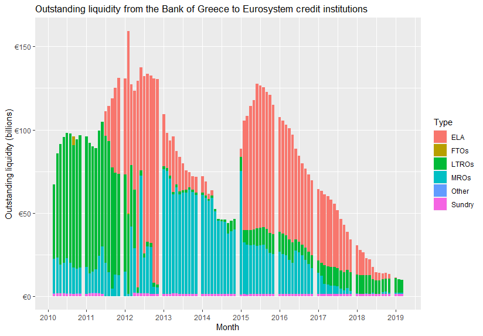

# ela

In 2011, the Bank of Greece began to provide Emergency Liquidity Assistance (ELA) to domestic banks.
While the Bank of Greece has been relatively transparent about the size and timing of its ELA, neither it nor any researchers have published data in machine-readable format.
This data is very important because Greece was, by far, the largest user of ELA and the first to offer it to all banks.
A large body of literature has grown up evaluating Greek ELA.

This repo makes available machine-readable Greek ELA data.

These are approximates.
Following [instructions](BankOfGreece_email.md) by the Financial Accounts Team at the Bank of Greece, I look at asset line 6, `Other claims on euro area credit institutions denominated in euro` to find outstanding ELA.
Line 6 includes other, small loans not included in ELA.
To remove those bits, I follow [Mourmouras](https://web.archive.org/web/20210128084556/https://www.bankofgreece.gr/en/news-and-media/press-office/news-list/news?announcement=c91acffb-3322-4472-82a0-90d17fc17cce) in subtracting the median line 6 amount over an arbitrary period before ELA began.
In this case, I subtract the median line 6 amount of the 24 monthly financial statements from August 2009 to July 2011.

To retrieve line 6 data, I scraped Bank of Greece's monthly balance sheets.
Formatting the whole balance sheet was not much harder than formatting line 6, so this repo also makes the entirety of those balance sheets available in a tidy format.
Let us pray the Bank of Greece does not reformat their financial statements anytime soon.

### next steps

* subtract/interpolate estimate of non-ELA line 6 and Sundry amounts
* make available the entire BOG balance sheet
  + stable composition (numbered by line)
  + changing composition

