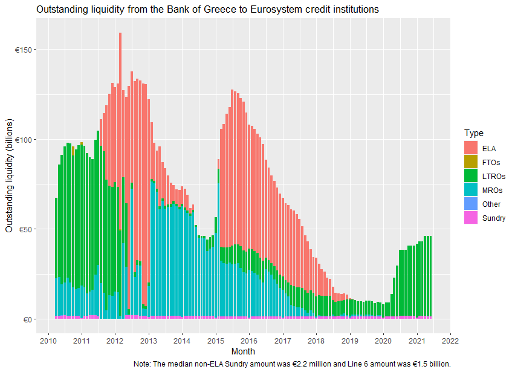

# ela

In 2011, the Bank of Greece began to provide Emergency Liquidity Assistance (ELA) to domestic banks.
While the Bank of Greece has been relatively transparent about the size and timing of its ELA, neither it nor any researchers have published data in machine-readable format.
This data is very important because Greece was, by far, the largest user of ELA and the first to offer it to all banks.
A large body of literature has grown up evaluating Greek ELA.

This repo makes available machine-readable Greek ELA data.

These are approximates.
Following [instructions](github_resources/BankOfGreece_email.md) by the Financial Accounts Team at the Bank of Greece, I look at asset line 6, `Other claims on euro area credit institutions denominated in euro` to find outstanding ELA.
Line 6 includes other, small loans not included in ELA.
To remove those bits, you can follow [Mourmouras](https://web.archive.org/web/20210128084556/https://www.bankofgreece.gr/en/news-and-media/press-office/news-list/news?announcement=c91acffb-3322-4472-82a0-90d17fc17cce) in subtracting the median line 6 amount over an arbitrary period before ELA began.
In this case, I note roughly two years before and after ELA.

To retrieve line 6 data, I scraped Bank of Greece's monthly balance sheets.
Formatting the whole balance sheet was not much harder than formatting line 6, so this repo also makes available [tidy](https://vita.had.co.nz/papers/tidy-data.html) [consolidated balance sheets](data_out/) from January 2002 to May 2021.
Below plots the Bank's balance sheet over the same time period.
You can see just when the Global Financial and Sovereign Debt crises hit Greece, as well as when ECB cut off Greece from its refinancing operations, forcing the Bank to provide liquidity through ELA.
This plot is the lightly formatted result of `greek_balance_sheet(accounting_period = c("2002-01-01", "2021-05-01"), composition = "constant")`.
To understand which lines are which, see [the example PDF](github_resources/2020_account.pdf).

Not included are December 2002, March 2003, and August 2003. The structure of December 2002 differs from all other balance sheets, and other PDFs are scanned paper copies, not native PDFs.
Let us pray the Bank of Greece does not reformat their financial statements anytime soon.